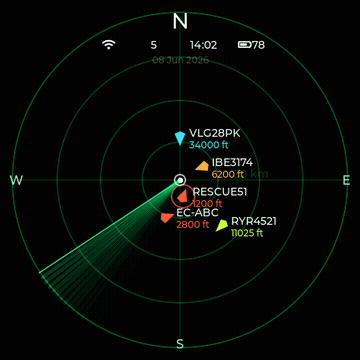
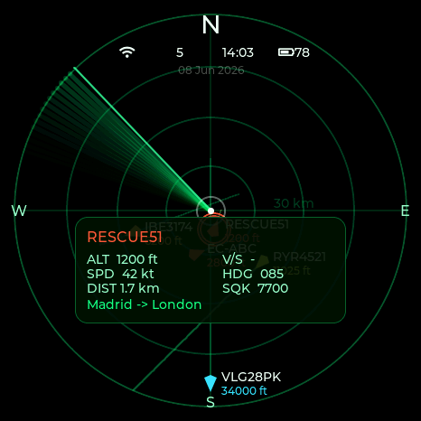
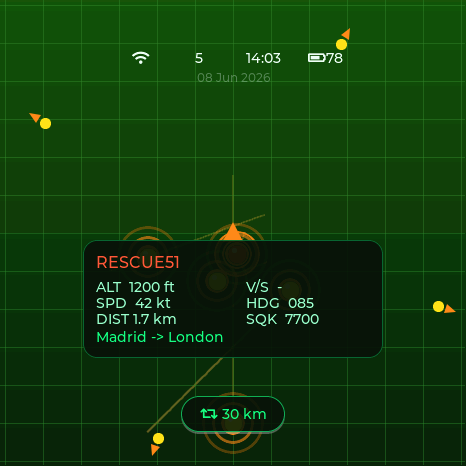
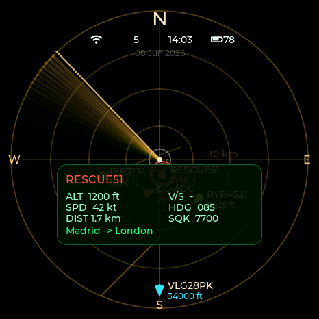
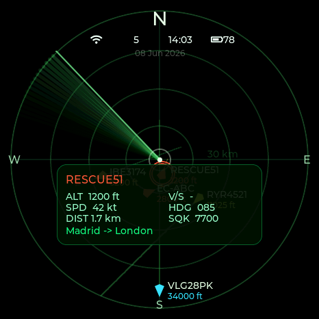

# Capsule Radar 🛩️

<p align="center">
  <a href="https://socquique.github.io/capsule-radar/"></a>
  <a href="https://makerworld.com/en/models/2907695-capsule-radar-live-flight-radar-desk-gadget"></a>
  
  <a href="https://github.com/socquique/capsule-radar/releases"></a>
  <a href="LICENSE"></a>
  
  <a href="https://github.com/socquique/capsule-radar/stargazers"></a>
</p>

A live **ADS-B aircraft radar** for the **Waveshare ESP32-S3-Touch-AMOLED-1.75** — a round 466×466 AMOLED with capacitive touch. It pulls nearby aircraft from a free online feed over WiFi and plots them on a touch radar scope centered on your location, with live flight details and selectable visual skins.

> Visual reference: open [`assets/plane_radar_2.0_mockup.html`](assets/plane_radar_2.0_mockup.html) in a browser.

<p align="center"></p>

| Phosphor | Orb | Amber CRT | Military |
|:--:|:--:|:--:|:--:|
|  |  |  |  |

<sub>Captured from the bundled desktop simulator (the device screen is round; the square corners are off-panel).</sub>

## Features

- **Live traffic** from [airplanes.live](https://airplanes.live) (free, non-commercial; fallback adsb.lol), updated every couple of seconds. Memory-safe streaming parser with a hard aircraft cap.
- **Four themes** (long-press the screen to cycle, or pick on the web; remembered across reboots):
  - **Phosphor** — green-on-black radar scope: rings, animated sweep, aircraft glyphs rotated by heading and color-coded by altitude, fading trails, emergency halo.
  - **Orb** — green gradient + grid scope: the 7 nearest aircraft as yellow orbs emitting waves, off-range traffic as edge arrows pointing its way, orange target rings.
  - **Amber CRT** and **Military** — the same scope retinted (warm amber / night-vision green).
- **Touch** (CST9217): tap an aircraft → detail card (callsign, type, altitude, vertical speed, ground speed, distance, heading, squawk, and **origin → destination** looked up from adsbdb, cached in NVS). **Double-tap** to cycle zoom range. Swipe between **Radar / List / Stats** (circular layouts).
- **Boot splash** + **alert pings** (ES8311 speaker): a soft ping when a new aircraft enters range, an urgent double-beep for emergency/military — volume & mute on the web page.
- **Smooth motion**: aircraft glyphs glide between polls (interpolated) instead of jumping, using cheap partial redraws.
- **Top HUD**: WiFi status (amber if the data feed is failing), in-range aircraft count, NTP/RTC clock, **battery %** (charging bolt, red when low), and the date. The Stats view footer shows how to reach the config page (`VNFlightradar.local` + IP).
- **Battery aware** (AXP2101): shows charge level, warns when low, and slows the feed poll rate on battery to save power.
- **Real-time clock** (PCF85063): keeps the time/date across power loss, so the clock is right even before/without WiFi; re-synced from NTP when online.
- **Smart brightness**: configurable idle auto-dim (no touch), and **face-down sleep** (QMI8658 IMU — flip it over to turn the screen off).
- **Configuration web page** at `http://VNFlightradar.local/` — center point, display range, theme, live brightness slider, WiFi reset. Settings persist in NVS.
- **First-boot WiFi setup** via a captive portal (`VNFlightRadar-Setup`).

## Hardware

Waveshare **ESP32-S3-Touch-AMOLED-1.75**: ESP32-S3R8 (8 MB PSRAM, 16 MB flash), **CO5300** AMOLED over QSPI, **CST9217** touch, **QMI8658** IMU, **PCF85063** RTC, **AXP2101** PMIC, **ES8311** audio + speaker, microSD. All pins are in [`src/config.h`](src/config.h) (sourced from the board definition; no guessing).

## Build & flash (PlatformIO)

```bash
pio run -e esp32-s3-amoled-175 -t upload     # build + flash over USB-C
pio device monitor -b 115200                  # serial log
```
On first flash you may need to hold **BOOT** then tap **RESET**. After flashing, on first boot connect your phone to the **`VN FlightRadar-Setup`** WiFi and enter your home network — real aircraft appear within seconds.

## Flash from your browser (no toolchain)

Makers can flash without installing anything using **ESP Web Tools** (Chrome or Edge on desktop):

1. Open the **[web flasher](https://socquique.github.io/capsule-radar/)** (the project's GitHub Pages site).
2. Plug the board in with a USB-C **data** cable and click **Install**.

The flasher is built and published automatically by GitHub Actions ([`.github/workflows/webflasher.yml`](.github/workflows/webflasher.yml)) on every push to `main` — enable it once in **Settings → Pages → Source = GitHub Actions**. Tagged releases (`git tag v1.0.0 && git push origin v1.0.0`) also attach a ready-to-flash `CapsuleRadar-esp32s3.bin` to a **GitHub Release** via [`release.yml`](.github/workflows/release.yml). To preview the flasher locally:

```bash
./scripts/build_webflasher.sh                      # build + merge into web/flash/
python3 -m http.server -d web/flash 8000           # serve (Web Serial works on localhost)
# open http://localhost:8000
```

## Desktop simulator

The whole UI is portable LVGL and runs on your computer (SDL2) — great for iterating without hardware:
```bash
pio run -e native -t exec     # opens a 466×466 window (needs SDL2: `brew install sdl2`)
```
Mouse = touch · `T` = switch theme · close the window to quit.

## Configuration

Browse to `http://VNFlightradar.local/` (or the device IP) on the same WiFi to set the **center lat/lon**, **display range**, **theme** and **brightness**, or to **reset WiFi**. Saving restarts the device to apply.

## Repo layout

```
src/
  config.h           pins + tunables (Dénia, Spain by default)
  main.cpp           tasks, WiFi/NTP, web config, brightness/IMU glue
  display.*          CO5300 (Arduino_GFX) + LVGL bring-up
  radar_view.*       the radar scope, aircraft, themes
  ui.*               views (radar/list/stats) + detail card + HUD
  touch_cst9217.*    capacitive touch driver
  imu_qmi8658.*      accelerometer (face-down sleep)
  battery.*          AXP2101 battery gauge
  rtc_pcf85063.*     PCF85063 real-time clock
  adsb_client.*      airplanes.live fetch + parse
  route*.* route.*   origin→destination lookup (adsbdb)
  sim_main.cpp       native SDL simulator (not flashed)
include/lv_conf.h    LVGL config (v8)
web/flash/           browser web-flasher (ESP Web Tools) for makers
scripts/             build_webflasher.sh (merge firmware -> single .bin)
docs/                hardware / data-source / architecture notes
```

## Data & license

**Firmware / code: [MIT](LICENSE)** — fork and build on it freely (keep the notice). Aircraft data: **airplanes.live** (free, **non-commercial / educational** — exactly this project; be polite with request cadence). Routes: **adsbdb.com** (free). Personal/hobby project. The 3D-printed enclosure is published on [MakerWorld](https://makerworld.com/en/models/2907695-capsule-radar-live-flight-radar-desk-gadget) (enclosure + this firmware).
